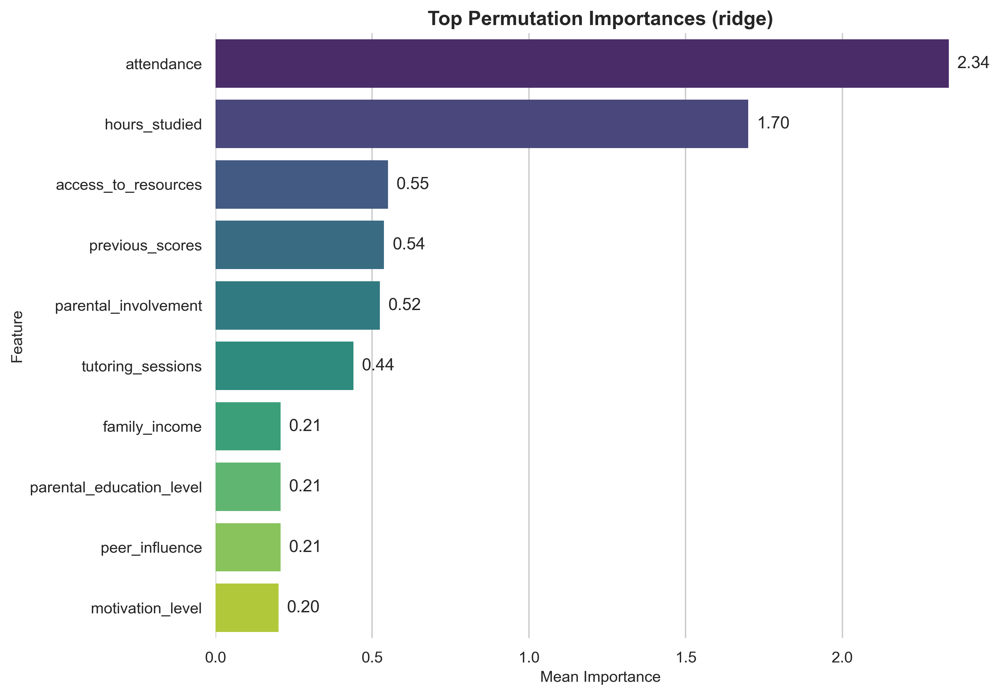
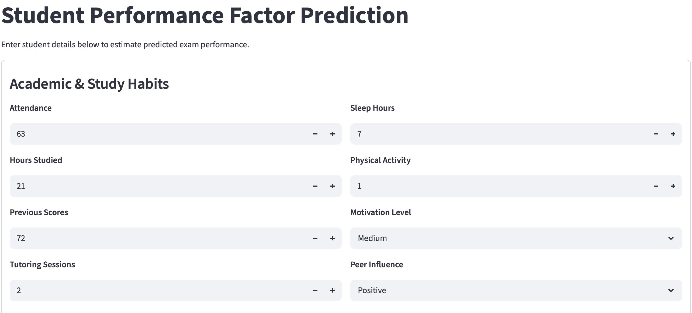
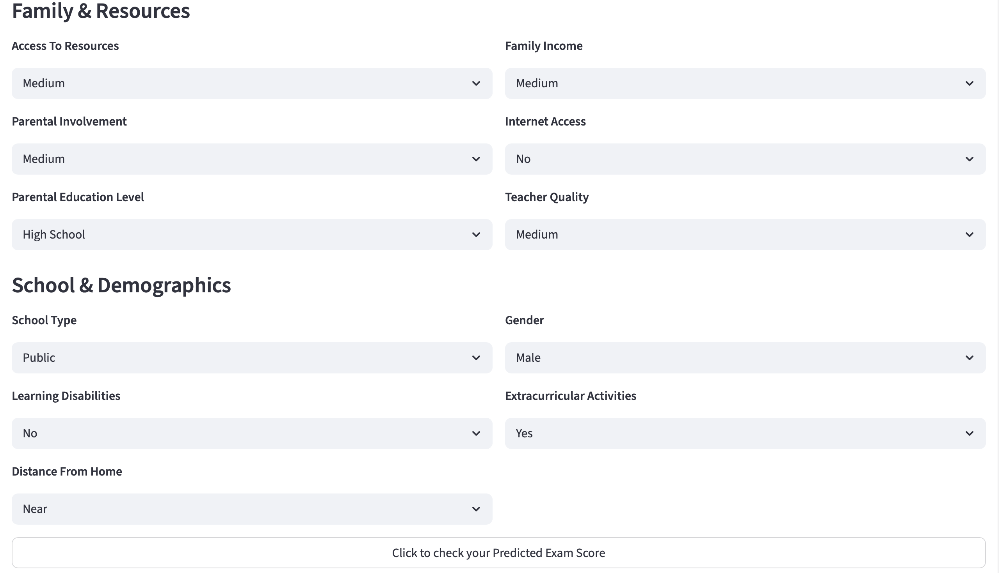

# Student Performance Factors - Capstone Project


## Overview (Data-Driven Insights into Student Academic Performance)

This capstone project is based on Kaggle's **Student Performance Factors Dataset**. The project is organized to align with a typical capstone rubric: project organization, code quality,
visualizations, modeling, findings, recommendations and What's Next.

### What the notebook includes
- business understanding and success criteria
- data loading and validation
- cleaning and preprocessing
- descriptive statistics
- inferential statistics
- visualizations for categorical and continuous variables
- multiple regression models
- cross-validation
- GridSearchCV hyperparameter tuning
- evaluation metric rationale
- model interpretation with permutation importance
- findings, recommendations, and next steps


##  Executive summary
This project analyzes the factors that influence student academic performance and builds predictive models to estimate future academic outcomes based on current student characteristics.

The goal is not only to predict grades but to translate findings into actionable recommendations for teachers, administrators and parents.

## Rationale
Student performance is influenced by multiple interconnected factors --- academic habits, socio-demographic background, and access to resources. However, decisions about interventions are often made based on assumptions rather than evidence.

This project aims to:
 - Identify the most influential factors affecting student grades
 - Distinguish strong predictors from weak or commonly assumed factors
 - Provide early indicators of academic risk
 - Deliver data-driven recommendations for performance improvement
 

## Research Question
Student academic performance is often discussed, but the drivers behind it are not always clearly understood. This capstone project will provide an actionable insights backed by data:

- Which features show the strongest relationship with exam performance?
- Which student and school factors are most useful for predicting **Exam_Score**?
- What practical recommendations follow from the analysis?
- How to make informed decisions grounded in data rather than assumptions


## Data Sources

The dataset will be sourced from Kaggle, using publicly available student performance data containing academic results and student background. 

### Kaggle dataset URL:
Download the compressed dataset from `https://www.kaggle.com/datasets/ayeshaseherr/student-performance`.

This dataset is commonly distributed with columns such as:
- Hours_Studied
- Attendance
- Parental_Involvement
- Access_to_Resources
- Extracurricular_Activities
- Sleep_Hours
- Previous_Scores
- Motivation_Level
- Internet_Access
- Tutoring_Sessions
- Family_Income
- Teacher_Quality
- School_Type
- Peer_Influence
- Physical_Activity
- Learning_Disabilities
- Parental_Education_Level
- Distance_from_Home
- Gender
- Exam_Score

### Place the dataset (csv file) inside:
`./data/`

### Expected filename with directory:
`./data/StudentPerformanceFactors.csv`

## EDA Conclusion

- Attendance (≈58%) and Hours_Studied (≈45%) dominate: improving presence and focused study time should yield the largest score gains.
- Prior achievement (Previous_Scores ≈18%) and Tutoring_Sessions (≈16%) show secondary influence—prioritize extra help and progress checks for students who are behind.
- Physical_Activity and Sleep_Hours hover near zero, suggesting little direct linear effect on exam scores in this dataset; keep healthy habits, but expect limited score impact without other supports.
- Cross-links among inputs are near zero, so these levers can be adjusted independently.


## Recommended setup
### Option 1: use the notebook install cell
Open the notebook and run the first code cell, which will install all dependencies.

### Option 2: terminal setup
```bash
python3.11 -m venv .venv
source .venv/bin/activate
python -m pip install --upgrade pip setuptools wheel
pip install -r requirements.txt
jupyter lab
```

## Project structure
```text
capstone-student-grade/
├── README.md
├── requirements.txt
├── data/
│   │   └── StudentPerformanceFactors.csv
├── notebooks/
│   └── student_performance_factors.ipynb
├── web/
│   └── main.py
│   └── ui_app.py
│   └── test.ipynb
│   └── ridge_spf_20260324_185422UTC.pkl
└── images/
    ├── spfc_best_performig_visual.png
    └── spfc_boxplot_category_features.png
    ├── spfc_correlation_heatmap.png
    └── crisp.png
    ├── spfc_features_distribution.png
    └── spfc_plot_imp_features.png
    ├── spfc_predicted_Vs_actual.png
    └── spfc_scatterplot_num_features.png
    ├── spfp_ui_1.png
    └── spfp_ui_2.png
```

## Methodology
This project follows the CRISP-DM framework:

### 1 Business Understanding
Define the key drivers of student performance and determine how findings can inform early intervention strategies.

### 2 Data Understanding
 - Exploratory Data Analysis (EDA)
 - Distribution analysis
 - Correlation analysis
 - Identification of patterns and anomalies

### 3 Data Preparation
 - Handling missing values
 - Encoding categorical variables
 - Feature engineering (e.g., effort index, pass/fail classification)
 - Train-test split

### 4. Preprocessing
The modeling pipeline includes:
- numeric imputation using median
- categorical imputation using most frequent value
- scaling with `StandardScaler`
- one-hot encoding for categorical features

### 5 Modeling
Trained a set of 7 baseline models and then applied Hyperparameter Tuning with GridSearchCV. The pipeline automatically selected the top three models; after baseline execution, by lowest MAE for tuning. Retrained them, and then programmatically chose the final best model—no manual selection required.
- LinearRegression
- Ridge
- RandomForestRegressor
- GradientBoostingRegressor
- Lasso
- KNeighborsRegressor
- HistGradientBoostingRegressor

### 6. Evaluation
Models were evaluated using:
- train/test split
- cross-validation
- **MAE** (Mean Absolute Error)
- **RMSE** (Root Mean Squared Error)
- **R²** score


### Primary evaluation metric
**MAE (Mean Absolute Error)** is treated as the primary metric as it keeps the error in exam-score points, which is easier to explain to a nontechnical audience. RMSE and R² are reported as supporting metrics. Compare cross-validated MAE, RMSE, and R². Explain the winning model in plain language.

## Findings

**This initiative reveals a stable hierarchy of factors impacting student performance, with `attendance` and `study hours` emerging as critical drivers of success. A secondary tier—including resource access, prior scores, tutoring, and parental involvement—offers a meaningful but lesser impact, while socio-economic factors and motivation show comparatively minimal influence. Because these rankings remain highly consistent, teachers, parents, and administrators can confidently focus their efforts on these top priorities to effectively support student achievement.**


## Below is a `segmented summary` of top 10 driving factors followed by a clear action.

**Teachers and Administrators**
- **[1] Attendance (`highest impact`) :**  Track attendance, provide early‑warning alerts, and consistent follow‑ups. At the same time consider identifying root causes of absences (transportation aka Distance from Home, Learning Disabilities, Motivation Level)

- **[2] Hours Studied :**  Teach effective study habits, set clear weekly expectations, and provide  structured study plans, homework routines, and offer time‑management support.

- **[3] Access to Resources :**  Ensure availability of textbooks, devices, internet, and study spaces.

- **[4] Previous Scores :**  Use diagnostic checks to identify gaps and deliver focused remediation early.

- **[6] Tutoring Sessions :**  Prioritize tutoring for students with the biggest gaps and track outcomes over time.

**Parents**

- **[5] Parental Involvement (most important in this group) :**  Set regular check‑ins, support homework routines, and stay connected with teachers.

- **[7] Family Income :**  It's not in control of school or student, however it impacts student's performance, hence consider leveraging school/community programs for materials, meals, or fee waivers.

- **[8] Parental Education Level :**  This too not in control of school or student, so sharing parent‑friendly guides and workshops so families can support learning regardless of academic background.

**Shared Responsibility (Teachers, Parents, Administrators)**

- **[9] Motivation Level :**  Set short‑term goals, recognize progress, and link effort to outcomes to sustain engagement.

- **[10] Peer Influence :**  Promote positive peer groups through mentorship, study circles, and collaborative activities.





## Baseline Interpretation

The results show that **`Ridge`** and **`Linear Regression`** perform best, tied with the lowest `MAE (0.51)`, lowest `RMSE (2.09)`, and highest `R² (0.72)`, indicating strong and consistent predictive accuracy. **Gradient Boosting** and **HistGradient Boosting** are slightly weaker but still solid (R² around 0.67–0.68). **Random Forest** trails with higher error and lower fit (R² 0.61). **Lasso** and **KNN** perform the worst in this comparison, with the highest errors and the lowest R² values.

| Model | MAE | RMSE | R2 |
|---|---:|---:|---:|
| Ridge | 0.51 | 2.09 | 0.72 |
| LinearRegression | 0.51 | 2.09 | 0.72 |
| GradientBoostingRegressor | 0.86 | 2.23 | 0.68 |
| HistGradientBoostingRegressor | 0.88 | 2.24 | 0.67 |
| RandomForestRegressor | 1.18 | 2.43 | 0.61 |
| Lasso | 1.45 | 2.60 | 0.56 |
| KNN | 1.53 | 2.75 | 0.51 |


##  Top 3 models with Hyperparameter tuning and  GridSearchCV

With hyperparameter tuning via GridSearchCV, **Ridge** and **Linear Regression** remain the top performers, unchanged at MAE 0.51, RMSE 2.09, and R² 0.72. **GradientBoostingRegressor** improves notably after tuning (MAE 0.64, RMSE 2.13, R² 0.70), closing the gap but still slightly behind the linear models. Overall, tuning helps the boosting model, while the linear baselines remain the most accurate and stable.

| Model | MAE | RMSE | R2 | Best Parameters
|---|---:|---:|---:|---:|
| Ridge | 0.51 | 2.09 | 0.72 | {'model__alpha': 10.0, 'model__solver': 'auto', 'model__tol': 0.001} |
| LinearRegression  | 0.51 | 2.09 | 0.72 | |
| GradientBoostingRegressor  | 0.64 | 2.13 | 0.70 | {'model__learning_rate': 0.1, 'model__max_depth': 2, 'model__max_features': 'sqrt', 'model__min_samples_leaf': 5, 'model__min_samples_split': 2, 'model__n_estimators': 400, 'model__subsample': 0.8} |


## Next steps
- Validate the model on a second dataset which is larger in size as well as later student cohort.
- Where feasible, incorporate demographic variables to uncover performance patterns and quantify their impact on `Exam_Score`.
- Collect richer behavioral variables if prediction quality is still limited.
- Deploy the workflow to cloud infrastructure using an automated MLOps pipeline, ensuring it’s reproducible for future cohorts.
- Use Generative AI to interpret model outputs and visuals, then produce a PDF white paper that summarizes findings and delivers a clear, actionable plan.


## Student Performance Factor Prediction UI

A lightweight local UI is available in the `web` folder:

- `web/main.py` exposes a FastAPI service with `GET /` and `POST /predict`.
- `web/ui_app.py` provides a Streamlit form for entering student inputs and viewing predicted performance. UI is pre populated with default values.
- `web/test.ipynb` acts as an unit test.
- The backend loads the best tuned model pipeline from the `.web/` directory.

### Screenshots of the User Interface
  


### Install dependencies
```bash
python -m pip install fastapi uvicorn joblib pandas scikit-learn
python -m pip install --upgrade streamlit
```

### Run locally
**1) Start the FastAPI backend**
```bash
cd web
uvicorn main:app --reload
```

**2) Start the Streamlit frontend (new terminal)**
```bash
cd web
streamlit run ui_app.py
```

**3) Open the UI**
```text
http://127.0.0.1:8501
```

## Note:
- The model file is located at `.web/ridge_spf_20260324_185422UTC.pkl`. A .pkl (pickle) file is a binary file used to serialize and save Python objects, most commonly trained models.  Which is used in User Interface, without retraining, preserving its learned parameters and state to predict the Exam_Score. 
- Use `scikit-learn==1.6.1` to avoid serialization compatibility issues.


## Notebook
- [Notebook — Student Performnce Factors](./notebooks/student_performance_factors.ipynb)

## Contact Information
For questions or feedback please reach out to `Ninad Patil`, using github profile. See [Notebook](./notebooks/student_performance_factors.ipynb) for code, visualizations images are in [here](./images/) with detailed results.
